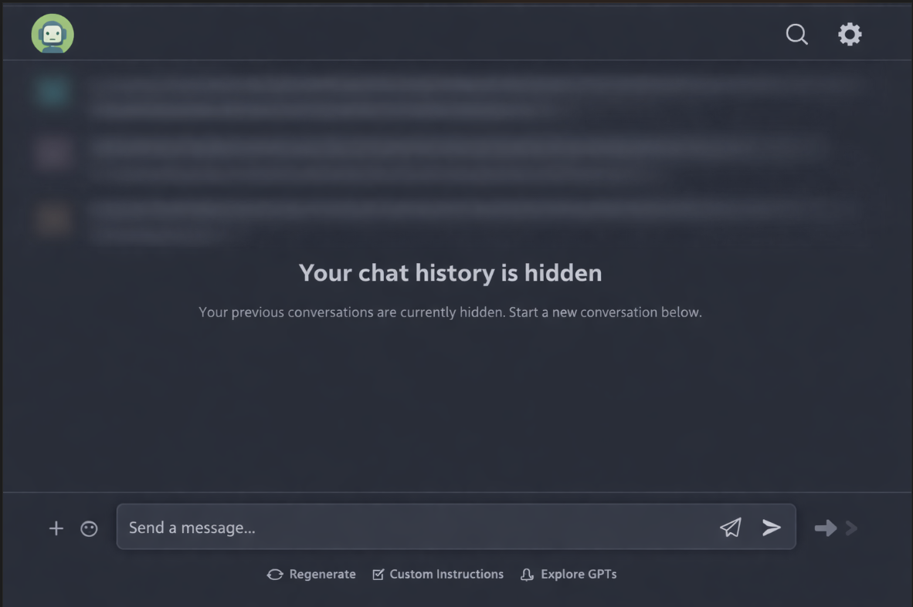

# AI Privacy Guard 🛡️

**AI Privacy Guard** is a professional-grade, zero-trust browser extension designed to keep your sensitive information private while using LLM platforms. It protects your screen from "shoulder surfing" and accidental data leaks during presentations, screen shares, or in public spaces.

## ✨ Core Features

### 🔒 Zero-Trust Privacy
- **100% Local**: No data ever leaves your browser. No external API calls, no tracking, and no analytics.
- **Deep Scoped**: Automatically becomes dormant on non-LLM websites to ensure zero interference with your normal browsing.

### 🧩 React-Safe Architecture
Unlike simple blur extensions that can break modern web apps (React, Angular, etc.), AI Privacy Guard uses a custom **Floating Redaction Layer**. It never modifies the original DOM text nodes, preventing hydration mismatches and application crashes.

### 🌓 Presentation Mode
- **Global Blur**: Instantly blur your entire chat history sidebar.
- **Hover to Reveal**: Need to find a specific chat? Just hover over a blurred item to temporarily peek behind the curtain.
- **Selective Keywords**: Only want to hide specific projects? Enter keywords (e.g., `budget, project-x, salary`) to only blur matching conversations.

### 🕵️ Automated Secret Redaction
The extension automatically identifies and masks developer secrets in real-time, including:
- **Cloud Credentials**: AWS Access Keys (AKIA/ASIA).
- **Authentication**: JWTs, GitHub PATs, Slack tokens.
- **AI API Keys**: OpenAI (`sk-proj-...`), Anthropic (`sk-ant-...`), Google AI Studio.
- **Generic Secrets**: Private keys, passwords, and sensitive assignments.

---

## 🚀 Supported Platforms

AI Privacy Guard is custom-tuned for the world's most popular LLM interfaces:

| | | | |
|---|---|---|---|
| **ChatGPT** | **Claude** | **Gemini** | **Perplexity** |
| **DeepSeek** | **Microsoft Copilot** | **Grok (x.com)** | **Mistral** |
| **Meta AI** | **Poe** | **Sarvam** | **AI Studio** |

---

## 🛠️ Installation

1.  **Download/Clone** this repository to your local machine.
2.  Open Chrome and navigate to `chrome://extensions`.
3.  Enable **"Developer mode"** in the top-right corner.
4.  Click **"Load unpacked"**.
5.  Select the folder containing this extension's files.

---

## ⌨️ Shortcuts & Usage

-   **Toggle Presentation Mode**: `Alt + Shift + P` (Windows/Linux/Mac)
-   **Quick Access**: Click the extension icon in your toolbar to manage keywords and master settings.
-   **Badge Feedback**: Look at the extension icon for status:
    -   🟢 **ON**: Extension is actively protecting the current page.
    -   🔴 **OFF**: Extension is disabled or current page is not a supported LLM.

---

## 🛡️ Security Policy

AI Privacy Guard is built with a security-first mindset:
- **Strict CSP**: Eliminates inline styles and scripts to prevent XSS.
- **No Dependencies**: Pure Vanilla JS and CSS for transparency and performance.
- **Open Source**: Audit the code yourself—everything stays local.

---

*AI Privacy Guard v1.0.1 — Protecting your privacy in the age of AI.*
